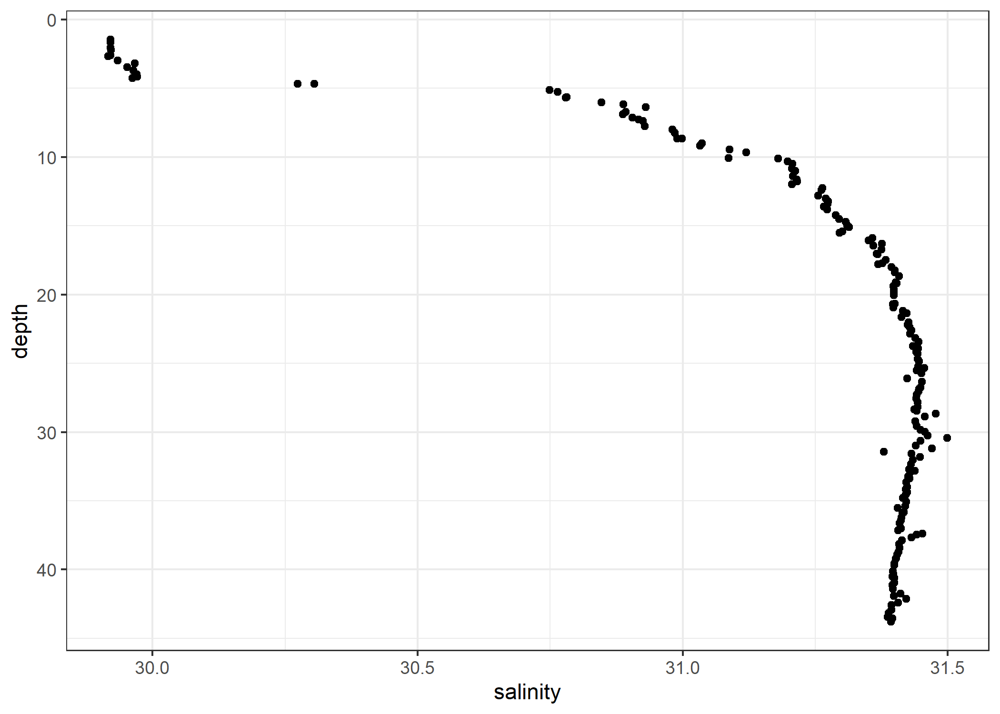
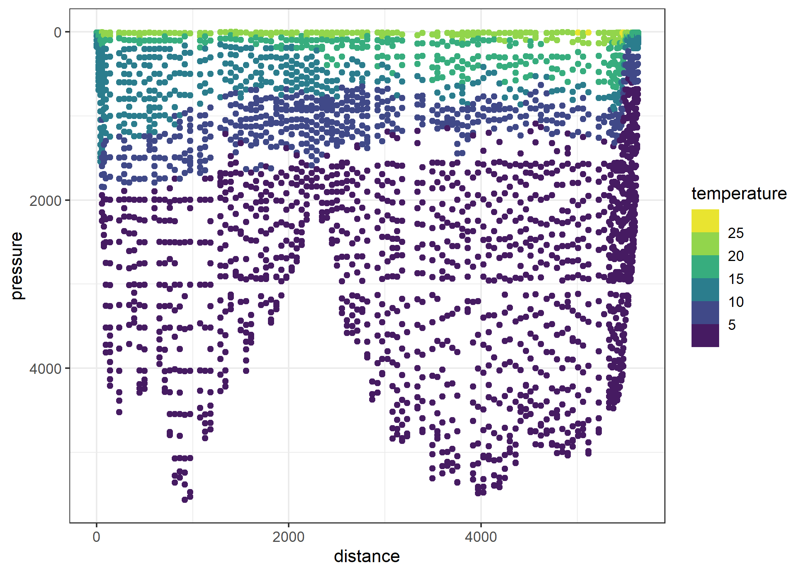
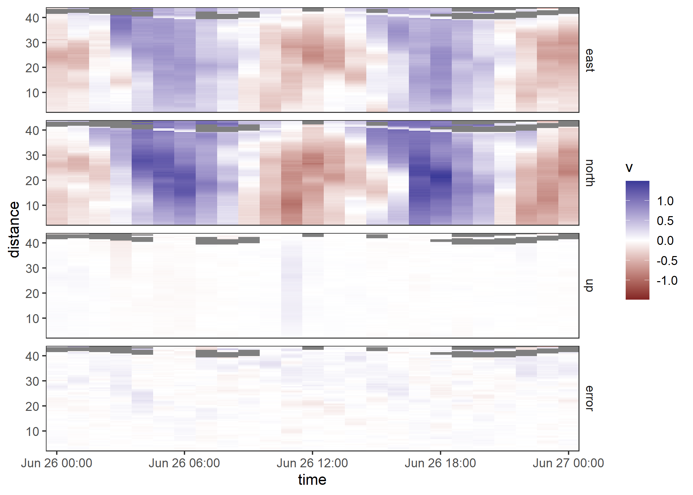
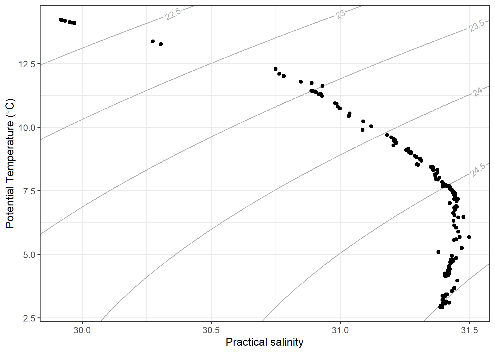

<!-- README.md is generated from README.Rmd. Please edit that file -->

# ggoce

<!-- badges: start -->

[](https://lifecycle.r-lib.org/articles/stages.html#experimental)
[](https://github.com/paleolimbot/ggoce/actions)
[](https://codecov.io/gh/paleolimbot/ggoce?branch=master)
<!-- badges: end -->

The goal of ggoce is to provide a minimal set of
[ggplot2](https://ggplot2.tidyverse.org) components to make
publication-quality plots of [oce](https://dankelley.github.io/oce/)
objects. **It is currently under initial proof-of-concept development
and should be used for entertainment purposes only.**

## Installation

You can install the development version from
[GitHub](https://github.com/) with:

``` r
# install.packages("remotes")
remotes::install_github("paleolimbot/ggoce")
```

## Example

The ggoce package lets you pass ‘oce’ objects into ggplot2 functions as
if they were data frames.

``` r
library(ggplot2)
library(ggoce)
theme_set(theme_oce())
data(ctd, package = "oce")

ggplot(ctd, aes(x = salinity, y = depth)) +
  geom_point() +
  scale_y_reverse()
```



You can see the actual data frames that are generated by calling the
`fortify()` methods directly. The `fortify()` methods are defined are
for “ctd”, “section”, and “adp” objects.

``` r
data(ctd, package = "oce")
data(section, package = "oce")
data(adp, package = "oce")


fortify(ctd)
#> # A tibble: 181 x 31
#>    pressureType deploymentType waterDepth model type  hexfilename   serialNumber
#>    <chr>        <chr>          <lgl>      <chr> <chr> <chr>         <chr>       
#>  1 sea          unknown        NA         25    SBE   "c:\\seasoft~ ""          
#>  2 sea          unknown        NA         25    SBE   "c:\\seasoft~ ""          
#>  3 sea          unknown        NA         25    SBE   "c:\\seasoft~ ""          
#>  4 sea          unknown        NA         25    SBE   "c:\\seasoft~ ""          
#>  5 sea          unknown        NA         25    SBE   "c:\\seasoft~ ""          
#>  6 sea          unknown        NA         25    SBE   "c:\\seasoft~ ""          
#>  7 sea          unknown        NA         25    SBE   "c:\\seasoft~ ""          
#>  8 sea          unknown        NA         25    SBE   "c:\\seasoft~ ""          
#>  9 sea          unknown        NA         25    SBE   "c:\\seasoft~ ""          
#> 10 sea          unknown        NA         25    SBE   "c:\\seasoft~ ""          
#> # ... with 171 more rows, and 24 more variables: serialNumberTemperature <chr>,
#> #   serialNumberConductivity <chr>, systemUploadTime <dttm>, ship <chr>,
#> #   scientist <chr>, institute <chr>, address <chr>, cruise <chr>,
#> #   station <chr>, date <dttm>, startTime <dttm>, recoveryTime <lgl>,
#> #   latitude <dbl>, longitude <dbl>, sampleInterval <dbl>,
#> #   sampleIntervalUnits <chr>, filename <chr>, scan <int>, timeS <dbl>,
#> #   pressure <dbl>, depth <dbl>, temperature <dbl>, salinity <dbl>, flag <dbl>
fortify(section)
#> # A tibble: 2,841 x 14
#>    stationId longitude latitude time                distance pressure
#>    <chr>         <dbl>    <dbl> <dttm>                 <dbl>    <dbl>
#>  1 3             -8.53     36.9 1993-09-23 22:22:00      0        8.4
#>  2 3             -8.53     36.9 1993-09-23 22:22:00      0       48.3
#>  3 3             -8.53     36.9 1993-09-23 22:22:00      0       97.8
#>  4 3             -8.53     36.9 1993-09-23 22:22:00      0      148. 
#>  5 3             -8.53     36.9 1993-09-23 22:22:00      0      178. 
#>  6 4             -8.62     36.7 1993-09-24 00:13:00     19.3     10.2
#>  7 4             -8.62     36.7 1993-09-24 00:13:00     19.3     50.5
#>  8 4             -8.62     36.7 1993-09-24 00:13:00     19.3    104. 
#>  9 4             -8.62     36.7 1993-09-24 00:13:00     19.3    152. 
#> 10 4             -8.62     36.7 1993-09-24 00:13:00     19.3    203  
#> # ... with 2,831 more rows, and 8 more variables: temperature <dbl>,
#> #   salinity <dbl>, salinityBottle <dbl>, oxygen <dbl>, silicate <dbl>,
#> #   nitrite <dbl>, NO2+NO3 <dbl>, phosphate <dbl>
fortify(adp)
#> # A tibble: 8,400 x 7
#>    time                distance beam        v q     a     g    
#>    <dttm>                 <dbl> <fct>   <dbl> <raw> <raw> <raw>
#>  1 2008-06-26 00:00:00     2.23 east  -0.120  6c    99    64   
#>  2 2008-06-26 01:00:00     2.23 east  -0.0993 6a    9d    64   
#>  3 2008-06-26 02:00:00     2.23 east   0.102  6b    9f    64   
#>  4 2008-06-26 03:00:00     2.23 east   0.0961 5f    87    64   
#>  5 2008-06-26 04:00:00     2.23 east   0.244  5c    8a    64   
#>  6 2008-06-26 05:00:00     2.23 east   0.289  72    99    64   
#>  7 2008-06-26 06:00:00     2.23 east   0.411  62    9c    64   
#>  8 2008-06-26 07:00:00     2.23 east   0.320  6e    96    64   
#>  9 2008-06-26 08:00:00     2.23 east   0.0717 70    91    64   
#> 10 2008-06-26 09:00:00     2.23 east  -0.0901 6b    91    64   
#> # ... with 8,390 more rows
```

For “section” and “adp” objects, there is more than one data frame one
might want to plot. To obtain these tables, call `fortify()` directly
and use the `which` argument:

``` r
fortify(section, which = "metadata")
#> # A tibble: 124 x 5
#>    stationId longitude latitude time                distance
#>    <chr>         <dbl>    <dbl> <dttm>                 <dbl>
#>  1 3             -8.53     36.9 1993-09-23 22:22:00      0  
#>  2 4             -8.62     36.7 1993-09-24 00:13:00     19.3
#>  3 6             -8.74     36.5 1993-09-24 04:19:00     42.0
#>  4 7             -8.79     36.4 1993-09-24 07:10:00     55.4
#>  5 8             -8.90     36.2 1993-09-24 10:22:00     77.1
#>  6 9             -9.27     36.2 1993-09-24 14:50:00     97.4
#>  7 10            -9.88     36.2 1993-09-24 20:41:00    141. 
#>  8 12           -11.1      36.3 1993-09-25 09:51:00    237. 
#>  9 13           -11.7      36.3 1993-09-25 14:53:00    288. 
#> 10 14           -12.3      36.3 1993-09-25 20:11:00    341. 
#> # ... with 114 more rows
fortify(section, which = "data")
#> # A tibble: 2,841 x 9
#>    pressure temperature salinity salinityBottle oxygen silicate nitrite
#>       <dbl>       <dbl>    <dbl>          <dbl>  <dbl>    <dbl>   <dbl>
#>  1      8.4        16.5     36.1           36.1   253      0       0.04
#>  2     48.3        14.9     36.1           36.1   215.     3.33    0.08
#>  3     97.8        14.0     36.0           36.0   193.     6.23    0.14
#>  4    148.         13.6     35.9           35.9   204.     5.67    0.06
#>  5    178.         13.0     35.8           35.8   208.     5.8     0.01
#>  6     10.2        17.7     36.2           36.2   248.     1.34    0.04
#>  7     50.5        16.2     36.1           36.1   251.     1.5     0.11
#>  8    104.         14.6     36.1           36.1   219.     3.56    0.01
#>  9    152.         14.1     36.0           36.0   214.     4.29    0.01
#> 10    203          13.6     35.9           35.9   213      5.05    0.01
#> # ... with 2,831 more rows, and 2 more variables: NO2+NO3 <dbl>,
#> #   phosphate <dbl>
fortify(section, which = "combined")
#> # A tibble: 2,841 x 14
#>    stationId longitude latitude time                distance pressure
#>    <chr>         <dbl>    <dbl> <dttm>                 <dbl>    <dbl>
#>  1 3             -8.53     36.9 1993-09-23 22:22:00      0        8.4
#>  2 3             -8.53     36.9 1993-09-23 22:22:00      0       48.3
#>  3 3             -8.53     36.9 1993-09-23 22:22:00      0       97.8
#>  4 3             -8.53     36.9 1993-09-23 22:22:00      0      148. 
#>  5 3             -8.53     36.9 1993-09-23 22:22:00      0      178. 
#>  6 4             -8.62     36.7 1993-09-24 00:13:00     19.3     10.2
#>  7 4             -8.62     36.7 1993-09-24 00:13:00     19.3     50.5
#>  8 4             -8.62     36.7 1993-09-24 00:13:00     19.3    104. 
#>  9 4             -8.62     36.7 1993-09-24 00:13:00     19.3    152. 
#> 10 4             -8.62     36.7 1993-09-24 00:13:00     19.3    203  
#> # ... with 2,831 more rows, and 8 more variables: temperature <dbl>,
#> #   salinity <dbl>, salinityBottle <dbl>, oxygen <dbl>, silicate <dbl>,
#> #   nitrite <dbl>, NO2+NO3 <dbl>, phosphate <dbl>

fortify(adp, which = "metadata")
#> # A tibble: 25 x 24
#>    time                pressure temperature salinity depth soundSpeed heading
#>    <dttm>                 <dbl>       <dbl>    <int> <dbl>      <int>   <dbl>
#>  1 2008-06-26 00:00:00     40.0        3.82       35  39.7       1467    295.
#>  2 2008-06-26 01:00:00     40.1        3.64       35  39.8       1466    295.
#>  3 2008-06-26 02:00:00     40.0        3.63       35  39.8       1466    295.
#>  4 2008-06-26 03:00:00     39.4        3.79       35  39.2       1466    295.
#>  5 2008-06-26 04:00:00     39.1        3.86       35  38.8       1467    276.
#>  6 2008-06-26 05:00:00     38.6        3.45       35  38.3       1465    276.
#>  7 2008-06-26 06:00:00     38.2        3.83       35  37.9       1467    275.
#>  8 2008-06-26 07:00:00     37.9        3.65       35  37.6       1466    275.
#>  9 2008-06-26 08:00:00     38.0        3.66       35  37.8       1466    275.
#> 10 2008-06-26 09:00:00     38.4        3.64       35  38.1       1466    275.
#> # ... with 15 more rows, and 17 more variables: pitch <dbl>, roll <dbl>,
#> #   headingStd <dbl>, pitchStd <dbl>, rollStd <dbl>, pressureStd <int>,
#> #   xmitCurrent <dbl>, xmitVoltage <dbl>, ambientTemp <dbl>,
#> #   pressurePlus <dbl>, pressureMinus <dbl>, attitudeTemp <dbl>,
#> #   attitude <dbl>, contaminationSensor <dbl>, orientation <chr>,
#> #   ensembleNumber <dbl>, ensembleInFile <int>
fortify(adp, which = "bottom_track")
#> # A tibble: 100 x 2
#>    time                beam 
#>    <dttm>              <fct>
#>  1 2008-06-26 00:00:00 east 
#>  2 2008-06-26 01:00:00 east 
#>  3 2008-06-26 02:00:00 east 
#>  4 2008-06-26 03:00:00 east 
#>  5 2008-06-26 04:00:00 east 
#>  6 2008-06-26 05:00:00 east 
#>  7 2008-06-26 06:00:00 east 
#>  8 2008-06-26 07:00:00 east 
#>  9 2008-06-26 08:00:00 east 
#> 10 2008-06-26 09:00:00 east 
#> # ... with 90 more rows
fortify(adp, which = "velocity")
#> # A tibble: 8,400 x 7
#>    time                distance beam        v q     a     g    
#>    <dttm>                 <dbl> <fct>   <dbl> <raw> <raw> <raw>
#>  1 2008-06-26 00:00:00     2.23 east  -0.120  6c    99    64   
#>  2 2008-06-26 01:00:00     2.23 east  -0.0993 6a    9d    64   
#>  3 2008-06-26 02:00:00     2.23 east   0.102  6b    9f    64   
#>  4 2008-06-26 03:00:00     2.23 east   0.0961 5f    87    64   
#>  5 2008-06-26 04:00:00     2.23 east   0.244  5c    8a    64   
#>  6 2008-06-26 05:00:00     2.23 east   0.289  72    99    64   
#>  7 2008-06-26 06:00:00     2.23 east   0.411  62    9c    64   
#>  8 2008-06-26 07:00:00     2.23 east   0.320  6e    96    64   
#>  9 2008-06-26 08:00:00     2.23 east   0.0717 70    91    64   
#> 10 2008-06-26 09:00:00     2.23 east  -0.0901 6b    91    64   
#> # ... with 8,390 more rows
```

The default methods for each of these are called when you pass it to
`ggplot()` and are chosen such that the variables you probably want to
use are available:

``` r
ggplot(section, aes(distance, pressure)) +
  geom_point(aes(col = temperature)) +
  scale_y_reverse() +
  scale_colour_viridis_b()
```



``` r
ggplot(adp, aes(time, distance, fill = v)) +
  geom_raster() +
  facet_grid(vars(beam)) +
  scale_fill_gradient2(limits = function(x) c(-max(abs(x)), max(abs(x)))) +
  coord_cartesian(expand = FALSE)
```



## TS plots

The ggoce package provides `geom_isopycnal()` to support creating
standard temperture/salinity diagrams.

``` r
ggplot(
  ctd,
  aes(
    x = salinity,
    y = oce::swTheta(
      salinity,
      temperature,
      pressure
    )
  )
) +
  geom_isopycnal() +
  geom_point() +
  labs(
    x = "Practical salinity",
    y = "Potential Temperature (°C)"
  )
```


